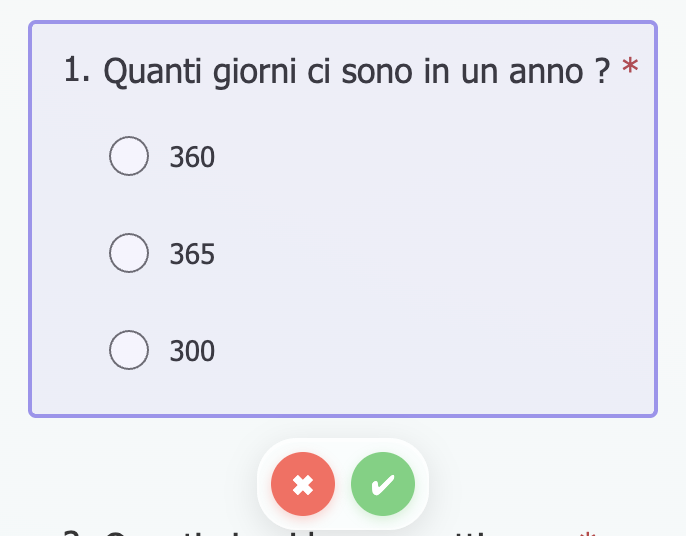
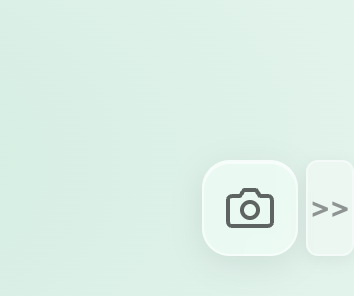
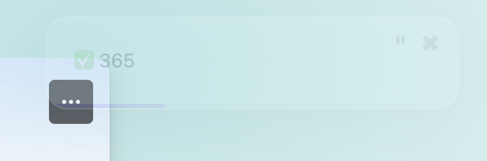
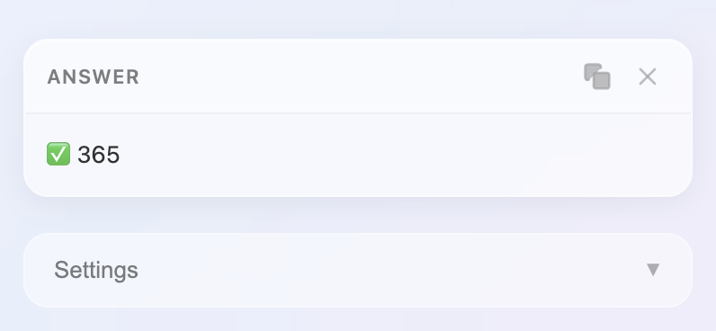
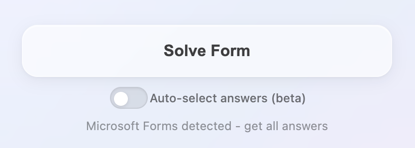

<p align="center">
  
</p>

<h1 align="center">Answery</h1>

<p align="center">
  <strong>Capture any area of your screen and get instant AI-powered answers.</strong>
</p>

<p align="center">
  
  
  
  
</p>

---

## Overview

**Answery** is a Chrome extension that lets you select any region of your screen, capture it, and instantly send it to an AI model for analysis. Whether it's a math problem, a chart, a code snippet, or a question on a webpage — just select the area and get your answer in seconds.

It also features a **Form Solver** that can automatically scrape and solve text-based multiple choice questions. Currently supporting Microsoft Forms only.

Answery is designed to be fast, minimal, and unobtrusive.

---

## Features

- **🖼️ Area Capture** — Select any rectangular region on any webpage to capture and analyze.
- **🤖 AI-Powered Analysis** — Powered by Google Gemini vision models (3 Pro, 3 Flash, 2.5 Pro, 2.5 Flash, 2.5 Flash Lite).
- **📝 Form Solver** — Automatically scrape and solve text-based multiple choice questions. Optionally auto-select the correct answers on the page.
- **⚡ Quick Capture Button** — A draggable floating button on every page for instant one-click capture.
- **🥷 Stealth Mode** — Results appear nearly invisible and are only revealed on hover. Capture is triggered via keyboard shortcut only — no visible UI.
- **📌 In-App Results** — Option to display AI responses directly inside the extension popup instead of as a floating overlay on the page.
- **⏱️ Auto-Dismiss Timer** — Response popups automatically close after a configurable duration, with a pause button to keep them visible.
- **⌨️ Keyboard Shortcut** — Press `⌘+Shift+Y` (or  `Ctrl+Shift+Y` on Windows) to start a capture without opening the extension popup.
- **🎨 Custom Instructions** — Set a default prompt to guide how the AI analyzes every capture.
- **🔒 Local Storage** — Your API key and settings are stored locally in the browser. Nothing is sent to external servers except the image data to the Gemini API.

---

## Installation

### From Source (Developer Mode)

1. **Clone** this repository:
   ```bash
   git clone https://github.com/SKEGGIA27/Answery.git
   ```

2. Open **Google Chrome** and navigate to:
   ```
   chrome://extensions
   ```

3. Enable **Developer mode** (toggle in the top-right corner).

4. Click **"Load unpacked"** and select the cloned `Answery` folder.

5. The Answery icon will appear in your browser toolbar. Click it to get started.

### Gemini API Key Setup

Answery requires a **Google Gemini API key** to function:

1. Visit [Google AI Studio](https://aistudio.google.com/apikey) and create a free API key.
2. Open the Answery popup, expand **Settings**, and paste your key in the **API Key** field.
3. Your key is saved locally and is never shared with anyone other than Google's API.

---

## How to Use

### Basic Capture

1. Click the **Answery icon** in the toolbar to open the popup.
2. Click **"Capture Area"**.
3. Draw a rectangle around the area you want to analyze.
4. Confirm the selection with the **✔** button (or cancel with **✖**).
5. Wait for the AI response to appear as a floating popup on the page or in the extension UI.

<p align="center">
  
</p>

### Quick Capture Button

Enable **"Quick Capture Button"** in Settings to show a floating, draggable button on every webpage. Click it to instantly start a capture without opening the extension.

<p align="center">
  
</p>

### Keyboard Shortcut

Press **`Ctrl+Shift+Y`** (Windows/Linux) or **`⌘+Shift+Y`** (Mac) to start a capture directly.

### Stealth Mode

Enable **"Stealth Mode"** in Settings for a completely discrete experience:
- The floating button is hidden.
- Capture is only triggered via keyboard shortcut.
- The response popup appears nearly transparent and only becomes fully visible when you hover over it.
- Adjust the **Popup Transparency** slider to control how invisible the response appears.
- For a full discrete experience, combine stealth mode with the **In-App Results only** switch to display the response in the extension UI instead of as a floating overlay on the page.

<table>
<tr>
<td align="center">
  <br>
  <em>Stealth Mode with popup transparency set to 80%. Hovering over the popup reveals it fully. Increase the percentage to make it even less visible.</em>
</td>
<td align="center">
  <br>
  <em>Stealth Mode with "In-App Results Only" enabled — the response is shown inside the extension popup, with no floating overlay on the page.</em>
</td>
</tr>
</table>

> ** Tip:** When **"In-App Results Only"** is enabled, a red notification badge will appear on the Answery extension icon to let you know that a response is ready. Simply open the extension to view it.

### Form Solver (Microsoft Forms only)

1. Navigate to any **Microsoft Forms** quiz page.
2. Open the Answery popup — a **"Solve Form"** button will appear automatically.
3. Click **"Solve Form"** — the extension scrapes all text-based multiple choice questions and sends them to the AI.
4. Answers are displayed in the popup or as a floating overlay on the page (depending on the **In-App Results Only** setting).
5. **Optional:** Enable the **"Auto-select answers (beta)"** toggle to have the extension automatically click the correct options on the form.

> **Note:** Questions containing images are automatically skipped.

<p align="center">
  
</p>

---

## Prompt Examples

Customize the **"Custom Instructions"** field to tailor how the AI responds. Here are some ideas:

| Use Case | Prompt Example |
|---|---|
| **Homework / Quizzes** | `Tell me the correct answer and briefly explain why.` |
| **Code Analysis** | `Explain what this code does and identify any bugs.` |
| **Translation** | `Translate all the text in this image to English.` |
| **Math Problems** | `Solve this math problem step by step and give me the final answer.` |
| **Summarization** | `Summarize the content visible in this image in 2-3 sentences.` |
| **Proofreading** | `Check this text for grammar or spelling errors and suggest corrections.` |

> **Note:** If no custom instruction is set, the default prompt is: *"Analyze the content in this image and provide a clear answer."*

### 📋 Recommended Prompt for Quizzes / Forms

This is our recommended prompt when using Answery to solve quizzes or forms. Pick the version in your preferred language:

<table>
<tr>
<th>🇮🇹 Italiano</th>
<th>🇬🇧 English</th>
</tr>
<tr>
<td>

```
Analizza l'immagine. Contiene una domanda
con delle possibili risposte.

ISTRUZIONI:
1. Identifica la domanda
2. Individua la/le risposta/e corretta/e
3. Rispondi SOLO con il formato indicato
   sotto, nessun commento aggiuntivo

FORMATO (risposta singola):
✅ [numero o testo della risposta]

FORMATO (risposte multiple):
✅ [prima risposta corretta]
✅ [seconda risposta corretta]
✅ [terza risposta corretta]

REGOLE:
- Se le risposte sono numerate o con
  lettere, usa il numero/lettera +
  testo breve
- Se il testo è lungo, riporta solo le
  prime parole sufficienti a identificarla
- Non aggiungere spiegazioni, commenti
  o introduzioni
- Usa SOLO il formato con ✅ per ogni
  risposta corretta
```

</td>
<td>

```
Analyze the image. It contains a question
with possible answers.

INSTRUCTIONS:
1. Identify the question
2. Determine the correct answer(s)
3. Respond ONLY using the format indicated
   below, with no additional comments

FORMAT (single answer):
✅ [number or text of the answer]

FORMAT (multiple answers):
✅ [first correct answer]
✅ [second correct answer]
✅ [third correct answer]

RULES:
- If the answers are numbered or labeled
  with letters, use the number/letter +
  a short text
- If the text is long, include only the
  first words necessary to identify it
- Do not add explanations, comments,
  or introductions
- Use ONLY the format with ✅ for each
  correct answer
```

</td>
</tr>
</table>

> **Tip:** Paste one of these into the **Custom Instructions** field in Settings to get clean, formatted answers when analyzing quiz screenshots.

---

## Settings Reference

| Setting | Description | Default |
|---|---|---|
| **AI Provider** | Which AI provider to use for analysis. | Google Gemini |
| **Gemini Model** | The specific Gemini model to query. | Gemini 3 Flash Preview |
| **API Key** | Your personal Google Gemini API key. | — |
| **Custom Instructions** | A default prompt sent with every capture. | *Analyze the content...* |
| **Quick Capture Button** | Show a floating capture button on web pages. | Off |
| **Stealth Mode** | Hide all visible UI; capture via shortcut only. | Off |
| **Popup Transparency** | How transparent the response popup is in Stealth Mode (0–100%). | 5% |
| **In-App Results Only** | Show responses inside the extension popup instead of on the page. | Off |
| **Result Display Time** | How long the floating response stays visible (in seconds). | 5 sec |
| **Auto-select answers** | Automatically click the correct answers on Microsoft Forms after solving. | Off |

---

## Project Structure

```
Answery/
├── manifest.json          # Extension configuration (Manifest V3)
├── background.js          # Service worker — handles capture, API calls, badge
├── content.js             # Content script — overlay, selection, response popup
├── content.style.css      # Styles for the on-page UI (overlay, popup, buttons)
├── popup.html             # Extension popup structure
├── popup.js               # Popup logic — settings, capture trigger, response display
├── popup.css              # Extension popup styling
├── icons/
│   ├── icon16.png         # Toolbar icon (16x16)
│   ├── icon32.png         # Toolbar icon (32x32)
│   ├── icon48.png         # Extension page icon (48x48)
│   └── icon128.png        # Chrome Web Store icon (128x128)
└── README.md
```

### Architecture

| Component | Role |
|---|---|
| **`popup.html/js/css`** | The extension popup UI. Handles settings management, capture triggering, and in-app response display. |
| **`content.js`** | Injected into web pages. Manages the screen selection overlay, capture confirmation, and floating response popups. |
| **`background.js`** | Service worker. Captures the visible tab screenshot, communicates with the Gemini API, and manages the notification badge. |
| **`content.style.css`** | Styles for all on-page elements (overlay, selection rectangle, confirm buttons, response popup, quick capture button). |

---

## Privacy & Security

- **No data collection.** Answery does not collect, store, or transmit any user data.
- **API key stays local.** Your Gemini API key is stored in Chrome's local storage and is only used to authenticate requests to the Google Gemini API.
- **Images are not stored.** Captured images are sent directly to the Gemini API for analysis and are not saved anywhere.
- **Open source.** The entire source code is available for review in this repository.

---

## Technologies

- **Chrome Extension Manifest V3**
- **Vanilla JavaScript** (no frameworks or dependencies)
- **Google Gemini API** (vision models)
- **HTML5 Canvas** for image cropping
- **CSS3** with glassmorphism design

---

## Contributing

Contributions are welcome! If you'd like to improve Answery:

1. Fork the repository.
2. Create a feature branch: `git checkout -b feature/my-feature`
3. Commit your changes: `git commit -m 'Add my feature'`
4. Push to the branch: `git push origin feature/my-feature`
5. Open a **Pull Request**.

---

## License

This project is licensed under the **MIT License** — see the [LICENSE](LICENSE) file for details.

---

<p align="center">
  Made with ☕ and curiosity.
</p>
